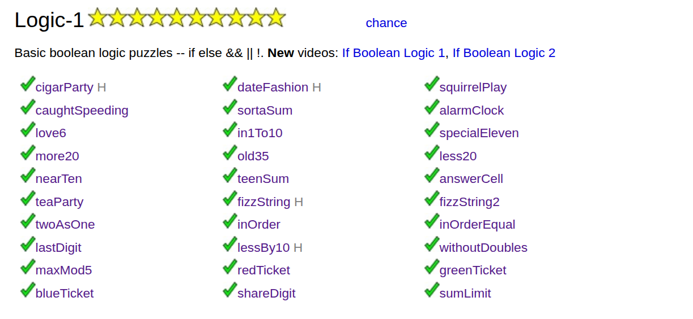

# CodingBat – Logic-1 (Java)

## 📌 Overview

This repository contains my solutions to the **Logic-1** section from CodingBat (Java track).

The Logic-1 problems focus on **basic boolean logic and conditional reasoning**, using:

* `if / else`
* boolean operators (`&&`, `||`, `!`)
* simple arithmetic conditions

These exercises helped me build a strong foundation in **decision-making logic in Java**.

---

## 🧠 Key Concepts Learned

### 1. Boolean Logic Fundamentals

* Understanding how to return `true` or `false` based on conditions
* Combining conditions using:

    * `&&` (AND)
    * `||` (OR)
    * `!` (NOT)

Example:

```java
return cigars >= 40 && cigars <= 60;
```

---

### 2. Conditional Statements (`if / else`)

* Writing clear branching logic
* Handling multiple cases in order of priority

Example:

```java
if (you <= 2 || date <= 2) return 0;
if (you >= 8 || date >= 8) return 2;
return 1;
```

---

### 3. Ternary Operator (`? :`)

* Writing concise conditions
* Replacing simple `if/else` with one-line expressions

Example:

```java
return isWeekend ? cigars >= 40 : cigars >= 40 && cigars <= 60;
```

---

### 4. Range Checking

* Checking if a value lies within a range
* Inclusive boundaries using `>=` and `<=`

Example:

```java
temp >= 60 && temp <= 90
```

---

### 5. Modifying Logic with Flags (Booleans)

* Changing behavior based on a boolean parameter

Example:

```java
int limit = isBirthday ? 65 : 60;
```

---

### 6. Multiple Condition Scenarios

* Structuring logic with priority rules
* Avoiding overlapping or conflicting conditions

Example:

```java
if (speed <= noTicketLimit) return 0;
if (speed <= smallTicketLimit) return 1;
return 2;
```

---

### 7. Edge Cases Handling

* Special ranges (like 10–19)
* Boundary values (e.g., exactly 60, 80, etc.)

Example:

```java
return sum >= 10 && sum <= 19 ? 20 : sum;
```

---

### 8. Boolean Variables for Readability

* Creating helper variables to simplify logic

Example:

```java
boolean weekday = day > 0 && day <= 5;
```

---

### 9. Returning Early (Guard Clauses)

* Writing cleaner code by returning early instead of nesting

Example:

```java
if (you <= 2 || date <= 2) return 0;
```

---

### 10. Clean and Readable Logic

* Keeping conditions simple and readable
* Avoiding unnecessary complexity

---

## 🧪 Example Problems Solved

Some of the problems completed in this section include:

* `cigarParty`
* `dateFashion`
* `squirrelPlay`
* `caughtSpeeding`
* `sortaSum`
* `alarmClock`
* and many more (~30+ logic problems)

These problems progressively improve your ability to:

* think logically
* handle conditions
* structure clean Java methods

---

## 🚀 What I Gained

* Strong understanding of **boolean reasoning**
* Ability to **translate real-world rules into code**
* Improved **code readability and structure**
* Confidence with **basic Java control flow**

---

## 📈 Next Steps

After completing Logic-1, the next logical steps are:

* Logic-2 (more complex conditions)
* String-1 (string manipulation)
* Array problems

---

## 💡 Notes

CodingBat is great because:

* Problems are short and focused
* Immediate feedback helps iteration
* Encourages clean and minimal solutions

---

## 🛠️ Tools Used

* Java
* IntelliJ IDEA
* CodingBat platform

---

## ✨ Example Code

```java
public boolean squirrelPlay(int temp, boolean isSummer) {
  return isSummer ? temp >= 60 && temp <= 100 : temp >= 60 && temp <= 90;
}

public int caughtSpeeding(int speed, boolean isBirthday) {
  int noTicketLimit = isBirthday ? 65 : 60;
  int smallTicketLimit = isBirthday ? 85 : 80;

  if (speed <= noTicketLimit) return 0;
  if (speed <= smallTicketLimit) return 1;

  return 2;
}
```

---

## ✅ Status

✔ Completed Logic-1
