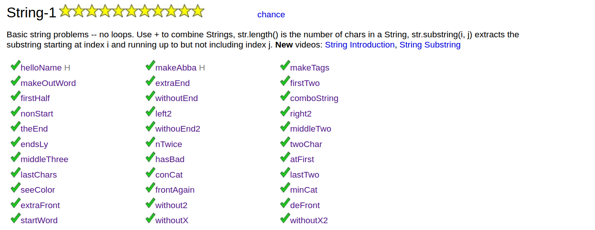

---

# 🚀 CodingBat – Java – String-1

## 📌 Context

As part of my Java practice using Maven, I completed the **String-1** section on CodingBat:
🔗 [https://codingbat.com/java/String-1](https://codingbat.com/java/String-1)

This set of exercises focuses on string manipulation in Java and helps reinforce core programming fundamentals.

---

## 🎯 Learning Objectives

Through these exercises, I worked on:

* ✅ Basic `String` manipulation
* ✅ Using built-in `String` methods
* ✅ Index management and substring extraction
* ✅ Length validation
* ✅ Conditional logic
* ✅ Handling edge cases (empty strings, short strings, etc.)

---

## 🧠 Skills Practiced

### 🔤 Common `String` Methods Used

* `length()`
* `substring()`
* `charAt()`
* `equals()`
* `startsWith()`
* `endsWith()`
* `toLowerCase()`
* String concatenation with `+`

---

## 📝 Exercises Completed

### 🔹 Concatenation & Formatting

* `helloName`
* `makeAbba`
* `makeTags`
* `makeOutWord`
* `comboString`
* `conCat`
* `minCat`

👉 Goal: Build new strings following specific formatting rules.

---

### 🔹 Substring Extraction

* `extraEnd`
* `firstTwo`
* `firstHalf`
* `withoutEnd`
* `middleTwo`
* `middleThree`
* `lastTwo`
* `extraFront`
* `twoChar`
* `nTwice`

👉 Goal: Practice safe index handling and avoid `StringIndexOutOfBoundsException`.

---

### 🔹 String Rotation

* `left2`
* `right2`

👉 Goal: Reconstruct strings by rearranging segments.

---

### 🔹 Pattern Detection

* `endsLy`
* `hasBad`
* `seeColor`
* `frontAgain`
* `startWord`

👉 Goal: Detect specific patterns inside strings.

---

### 🔹 Edge Case Handling

* `withoutEnd2`
* `lastChars`
* `without2`
* `deFront`
* `withoutX`
* `withoutX2`
* `nonStart`
* `theEnd`
* `atFirst`

👉 Goal: Write defensive code that safely handles short or special-case inputs.

---

## 💡 What I Learned

1. 🎯 Always check string length before calling `substring()`.
2. 🎯 Indexes start at 0.
3. 🎯 Most problems can be solved with clean substring decomposition.
4. 🎯 Simple logic is often better than complex condition chains.
5. 🎯 Testing edge cases (length 0, 1, or 2) is essential.

---

## 🏗 Project Structure

Standard Maven structure:

```text
├── src
│   ├── main
│   │   └── java
│   │       └── com
│   │           └── codingbat
│   │               ├── string1
│   │               │   ├── AtFirst.java
│   │               │   ├── ComboString.java
│   │               │   ├── ...
```

---

## 🔥 Outcome

This section helped me:

* Strengthen my Java fundamentals
* Improve precision when working with indexes
* Write cleaner and safer code
* Increase speed on basic algorithmic problems


