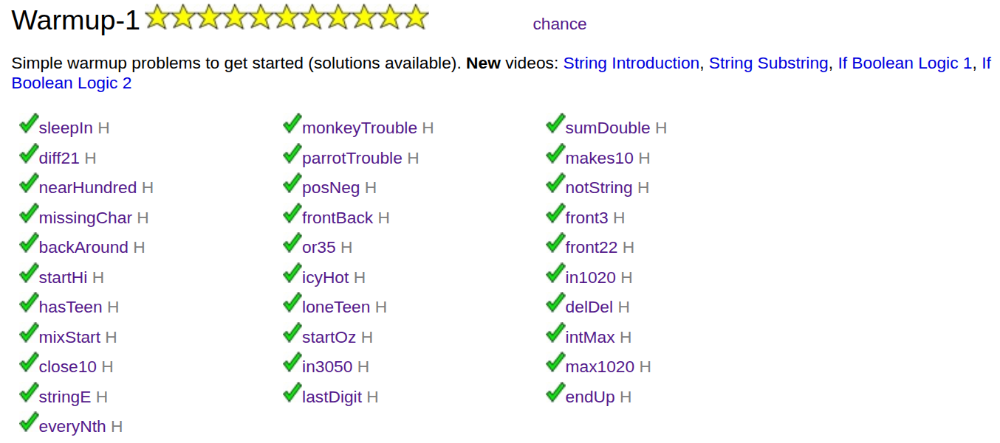

## 📌 Warmup-1 — Java Fundamentals Practice

This folder contains solutions and reflections for the **Warmup-1** exercises from CodingBat (Java). Warmup-1 is designed to build confidence and reinforce basic Java programming skills. Working through these problems helped me strengthen fundamental concepts that are essential for writing clear, correct, and maintainable code.

---

## 🧠 Concepts Practiced

### ✅ 1. **Basic Logic and Conditional Statements**

* Using `if`, `else if`, and boolean expressions to control program flow.
* Combining conditions using `&&`, `||`, and the importance of order and short-circuit evaluation.
* Understanding when to apply conditions early (e.g., exception cases) for clearer logic.

Example patterns:

* `if (condition) return ...; return ...;`
* Using ternary operators for simple conditional returns.

---

### ✅ 2. **Modular Arithmetic (`%` Operator)**

* Extracting the **last digit** of an integer using `% 10`.
* Checking for **multiples** of numbers.
* Recognizing patterns like “one off from a multiple” or “within a range using `%`”.

Common patterns:

```java
if (n % 10 <= 2 || n % 10 >= 8) …
if (n % 3 == 0 || n % 5 == 0) … 
```

---

### ✅ 3. **String Method Basics**

* Checking first and last characters using `charAt()` and `startsWith()`/`endsWith()` logic.
* Concatenating strings and returning formatted output.
* Handling edge cases for **empty or short strings** safely.

---

### ✅ 4. **Array Access and Safe Indexing**

* Accessing elements by index for fixed-length arrays.
* Carefully checking array length before accessing to avoid exceptions.
* Using `Math.min()` to handle varying array lengths safely.

---

## 🆕 Patterns & Best Practices Learned

### ✔ Safe Access

Always check the length of a string or array before calling `charAt()` or indexing.

```java
if (str.length() >= 1 && str.charAt(0) == 'f') …
```

---

### ✔ Short-Circuit Logic

Ternary expressions and boolean logic make code more compact without sacrificing clarity.

```java
return !isAsleep && (!isMorning || isMom);
```

---

### ✔ Helper Methods

Breaking logic into small helper functions improves readability and reuse.

```java
private boolean isTeen(int n) { return n >= 13 && n <= 19; }
```

---

## 🧹 Clean Code Habits Reinforced

* Use meaningful variable names (`firstValue`, `cGreater`, `weekday`).
* Prefer early returns for exceptional cases.
* Prefer simple logic before complicated combinations.
* Avoid unnecessary loops if direct index access works.

---

## 📌 What This Prepared Me For

Completing Warmup-1 helped me:

✔ Build a consistent approach for simple condition logic
✔ Handle common patterns (FizzBuzz-style logic, modulo fundamentals)
✔ Write safe and concise array/string code
✔ Practice readable, maintainable Java code

---

## 📁 Warmup-1 Solutions Included

This directory includes implementations for all Warmup-1 problems such as:

* `sleepIn`
* `monkeyTrouble`
* `sumDouble`
* `diff21`
* `parrotTrouble`
* `makes10`
* `nearHundred`
* `posNeg`
* `notString`
* `missingChar`
* `frontBack`
* `front3`
* & more

